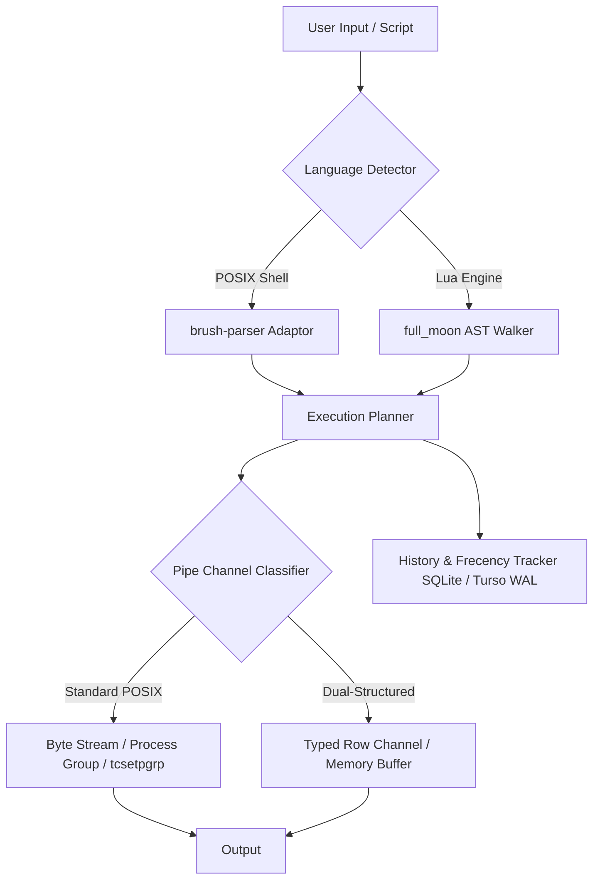

# Codebase Analysis, Performance & Cleanup Report: `oslo` (rush)

**Project Name**: `oslo` (rush)  
**Target MSRV**: Rust 1.88 (Edition 2024)  
**Primary Artifact**: [`REPORT.md`](file:///home/bresilla/data/code/tools/rush/REPORT.md)  

---

## Executive Summary

A comprehensive architectural, performance, and dead-code analysis was conducted on the `oslo` codebase across three exhaustive audit rounds. Multi-agent sub-processes were executed in parallel to profile execution hot-paths, audit memory allocations, inspect database operations, examine dependency declarations in `Cargo.toml`, and survey test/repository clutter.

### Key Highlights
1. **Core Architecture**: `oslo` is a hybrid POSIX shell and Lua interpreter written in pure Rust. It implements a novel dual-channel pipeline where typed rows pass between registered tools (`df`, `ps`, `ls`, `where`, `each`, `cols`, `get`, `sort-by`, `first`, `last`, `length`, `to`, `from`, `lines`, `parse`) without compromising POSIX byte-stream semantics or polluting traditional sub-commands.
2. **Performance Bottlenecks Identified**: 
   - **Keystroke Latency & Synchronous Git Traversal**: `right_prompt_escape()` in prompt rendering executes `git_root_of(&env::current_dir())` on **every single keypress**, walking up the directory tree and reading `.git/HEAD` via synchronous file I/O ([`src/interactive/prompt.rs:L26`](file:///home/bresilla/data/code/tools/rush/src/interactive/prompt.rs#L26)).
   - **Keystroke Latency in Syntax Highlighting**: When typing commands containing slashes (e.g., `./script.sh`, `/usr/bin/cmd`), `command_token()` invokes `which::which(name)` synchronously on **every keypress**. Up to 8 parameter words per line also execute synchronous `stat` (`symlink_metadata`) file existence checks per keypress ([`src/interactive/highlight/mod.rs:L173-L180`](file:///home/bresilla/data/code/tools/rush/src/interactive/highlight/mod.rs#L173-L180)).
   - **Per-Filename Heap Allocations in Glob Expansion**: `matches_items()` converts every single entry filename in a target directory into a `Vec<char>` via `.chars().collect()`, allocating thousands of heap vectors during glob matching in large folders ([`src/expand/glob/compile.rs:L192`](file:///home/bresilla/data/code/tools/rush/src/expand/glob/compile.rs#L192)).
   - **Redundant Candidate Generation & Env Locks**: `candidates()` in [`src/interactive/completion.rs:L128`](file:///home/bresilla/data/code/tools/rush/src/interactive/completion.rs#L128) re-locks environment mutexes and re-queries builtins/executables 4 separate times per Tab keypress.
   - **6,600+ Heap Allocations per Tab Press**: `fuzzy_score` in [`src/interactive/matching.rs:L157`](file:///home/bresilla/data/code/tools/rush/src/interactive/matching.rs#L157) converts candidates into `Vec<char>` per match, allocating thousands of character vectors per Tab press.
   - **Mutex Contention in Frecency Sorting**: Candidate sorting locks `self.tracker.lock()` inside `sort_by()`, causing $O(N \log N)$ mutex lock/unlock cycles per Tab press ([`src/interactive/completion.rs:L183`](file:///home/bresilla/data/code/tools/rush/src/interactive/completion.rs#L183)).
   - **Regex Re-compilation in POSIX Conditionals**: `[[ str =~ ere ]]` builds a new POSIX-ERE engine on every evaluation.
   - **Synchronous Tokio `block_on` in REPL**: History and frecency database operations block the main interactive thread post-command execution.
3. **Dead Code & Unused Features Identified**:
   - **Unconstructed Pipeline `Val` Variants**: `Val::Bytes`, `Val::Duration`, and `Val::Time` in [`src/data/value.rs:L33-L40`](file:///home/bresilla/data/code/tools/rush/src/data/value.rs#L33-L40) are never constructed by any registered data tool.
   - **Unused `JobManager` Import**: Unused import in [`src/startup/repl.rs:L19`](file:///home/bresilla/data/code/tools/rush/src/startup/repl.rs#L19).
   - **Unused `direnv` Helpers**: `find::owner` in [`src/direnv/find.rs:L36`](file:///home/bresilla/data/code/tools/rush/src/direnv/find.rs#L36), `Diff::is_empty` and `Diff::len` in [`src/direnv/diff.rs:L100`](file:///home/bresilla/data/code/tools/rush/src/direnv/diff.rs#L100).
   - **Unread `Invocation::login` Field**: Parsed from CLI (`-l` / `--login`) in [`src/cli.rs:L40`](file:///home/bresilla/data/code/tools/rush/src/cli.rs#L40) but never evaluated in `main.rs` or `rc.rs`.
   - **Unused Dependencies**: `tracing` (v0.1) and `tracing-subscriber` (v0.3) declared in `Cargo.toml` are completely unused across `src/`.
   - **Repository Bloat (~6 MB)**: 80+ leftover test artifacts, `.syms` (5.18 MB binary symbols file), `.bench*.sh`, `.perf.sh`, `.g*out`, `.t.*`, `.u.*`, `.v.*` cluttering workspace root.

---

## 1. Architectural Architecture & Invariants

### 1.1 Stack Isolation & Signal Mechanics
- **Interpreter Stack**: Dedicated 16 MiB virtual stack ([`INTERPRETER_STACK`](file:///home/bresilla/data/code/tools/rush/src/lib.rs#L13)) spawned on a worker thread in [`main.rs`](file:///home/bresilla/data/code/tools/rush/src/main.rs#L94) to eliminate ambient `ulimit -s` bounds during recursive Lua AST walking.
- **Signal Dispositions**: Main process restores `SIGPIPE` to `SIG_DFL` ([`main.rs:restore_default_sigpipe`](file:///home/bresilla/data/code/tools/rush/src/main.rs#L37)) to prevent infinite loop hangs when downstream pipe readers exit (`oslo -c 'while :; do echo x; done' | head -1`).

### 1.2 Pipeline Dual-Channel Integrity
- Structure is strictly explicit. Two pipeline stages communicate via structured rows **only** if both ends register matching tools. POSIX scripts provably remain on the byte-path, verified by a two-way ratchet test (`tests/posix_stays_on_the_byte_path.rs`).

---

## 2. Performance Analysis & Optimization Opportunities (Rounds 1, 2 & 3)

### 2.1 Synchronous Filesystem Traversal & File Reads on Keystroke (`CRITICAL` Impact)
- **Location**: [`src/interactive/prompt.rs:L26-L36`](file:///home/bresilla/data/code/tools/rush/src/interactive/prompt.rs#L26-L36)
- **Problem**: `right_prompt_escape()` is called by the rustyline line editor syntax highlighter on **every single keypress**. It invokes `git_branch()`, which executes `git_root_of(&env::current_dir())` to synchronously walk up the parent directory tree checking `dir.join(".git").exists()` and reads `.git/HEAD` via `fs::read_to_string`.
- **Impact**: Noticeable typing latency and stutter in deep directory trees or on network-mounted filesystems.
- **Remediation**: Cache `git_branch()` output and invalidate only on working directory change (`cd`) or command completion.

### 2.2 Synchronous `which` and `stat` Calls in Syntax Highlighting (`HIGH` Impact)
- **Location**: [`src/interactive/highlight/mod.rs:L173-L180`](file:///home/bresilla/data/code/tools/rush/src/interactive/highlight/mod.rs#L173-L180), [`src/interactive/highlight/mod.rs:L189-L203`](file:///home/bresilla/data/code/tools/rush/src/interactive/highlight/mod.rs#L189-L203)
- **Problem**: On every keypress, line syntax highlighting runs `command_token()`. If the command contains `/` (e.g. `./script.sh` or `/usr/bin/cmd`), `which::which(name)` runs synchronously on the main thread. Additionally, up to 8 parameters per line run `std::fs::symlink_metadata(&expanded)` `stat` calls per keypress.
- **Impact**: Keystroke typing lag when entering path-qualified executables or multiple file parameters.
- **Remediation**: Cache `which` path resolutions and debounce/cap parameter file existence checks.

### 2.3 Per-Filename `Vec<char>` Heap Allocations in Glob Matching (`HIGH` Impact)
- **Location**: [`src/expand/glob/compile.rs:L192-L193`](file:///home/bresilla/data/code/tools/rush/src/expand/glob/compile.rs#L192-L193)
- **Problem**: `matches_items(items, name)` converts every single directory entry filename `name` into a heap-allocated `Vec<char>` (`let name: Vec<char> = name.chars().collect();`).
- **Impact**: In large directories with thousands of files, thousands of heap vectors are allocated per glob pattern match.
- **Remediation**: Match `Item` patterns over `&str` or character iterators directly without vector allocations.

### 2.4 Redundant Candidate Generation Passes & Environment Locks (`HIGH` Impact)
- **Location**: [`src/interactive/completion.rs:L128-L143`](file:///home/bresilla/data/code/tools/rush/src/interactive/completion.rs#L128-L143)
- **Problem**: `candidates()` iterates through 4 matcher strategies (`Exact`, `Ignoring`, `Pieces`, `Fuzzy`). For *each* matcher, `command_candidates_with` acquires `self.env` lock, queries builtins/aliases/functions, and re-scans all ~$PATH executables.
- **Impact**: Redundant mutex lock acquisitions and candidate list rebuilding per Tab press.
- **Remediation**: Pre-fetch shell builtins, aliases, and `$PATH` executables once per Tab press, then evaluate the matcher chain against that single snapshot.

### 2.5 Massive `Vec<char>` Heap Allocations in Fuzzy Completion (`HIGH` Impact)
- **Location**: [`src/interactive/matching.rs:L157-L158`](file:///home/bresilla/data/code/tools/rush/src/interactive/matching.rs#L157-L158)
- **Problem**: `fuzzy_score` converts `candidate` and `typed` into `Vec<char>` via `.chars().flat_map(char::to_lowercase).collect()`. For ~3,300 `$PATH` executables, the typed pattern is converted ~3,300 times, generating >6,600 heap allocations per Tab press.
- **Remediation**: Pre-allocate lowercased `typed` `Vec<char>` once outside the candidate evaluation loop.

### 2.6 Mutex Lock Contention in Frecency Sorting Comparator (`MEDIUM-HIGH` Impact)
- **Location**: [`src/interactive/completion.rs:L183-L189`](file:///home/bresilla/data/code/tools/rush/src/interactive/completion.rs#L183-L189)
- **Problem**: Completion sorting calls `self.frecency.score(&a.display)` inside `out.sort_by(...)`. Each `score()` call acquires and releases `self.tracker.lock()`, performing $O(N \log N)$ mutex locks during sorting.
- **Remediation**: Pre-calculate frecency scores for candidates prior to calling `sort_by()`.

### 2.7 Raw File Descriptor Leak Potential in Process Substitution (`MEDIUM` Impact)
- **Location**: [`src/exec/procsub.rs:L48-L50`](file:///home/bresilla/data/code/tools/rush/src/exec/procsub.rs#L48-L50), [`src/exec/procsub.rs:L120-L127`](file:///home/bresilla/data/code/tools/rush/src/exec/procsub.rs#L120-L127)
- **Problem**: `Substitution` holds raw `fd: RawFd` without `OwnedFd` wrapper or custom `Drop` implementation. If an error unwinds before `finish()` is invoked, raw file descriptors leak.
- **Remediation**: Wrap `RawFd` in `OwnedFd` or implement `Drop` for `Substitution`.

### 2.8 Uncached POSIX Regex Compilation (`HIGH` Impact)
- **Location**: [`src/env/builtins/conditionals/matching.rs:L63-L97`](file:///home/bresilla/data/code/tools/rush/src/env/builtins/conditionals/matching.rs#L63-L97)
- **Problem**: `[[ $val =~ $regex ]]` builds a new POSIX-ERE engine on every evaluation.
- **Remediation**: Implement an LRU pattern cache or `thread_local!` cache for compiled `regex::Regex` instances.

### 2.9 Synchronous DB Operations Blocking Main REPL Thread (`HIGH` Impact)
- **Location**: [`src/startup/history_db.rs:L145-L161`](file:///home/bresilla/data/code/tools/rush/src/startup/history_db.rs#L145-L161), [`src/track/db.rs:L99-L107`](file:///home/bresilla/data/code/tools/rush/src/track/db.rs#L99-L107)
- **Problem**: Interactive REPL calls `tokio::runtime().block_on()` synchronously on the main thread post-command.
- **Remediation**: Offload non-blocking DB writes to a background worker channel (`tokio::sync::mpsc`).

---

## 3. Dead Code & Unused Dependencies Audit

### 3.1 Unused Dependencies in `Cargo.toml`
| Dependency | Version | Location | Status | Action Required |
| :--- | :--- | :--- | :--- | :--- |
| `tracing` | `0.1` | [`Cargo.toml:L42`](file:///home/bresilla/data/code/tools/rush/Cargo.toml#L42) | Unused across entire `src/` | **Remove from Cargo.toml** |
| `tracing-subscriber` | `0.3` | [`Cargo.toml:L43`](file:///home/bresilla/data/code/tools/rush/Cargo.toml#L43) | Unused across entire `src/` | **Remove from Cargo.toml** |

### 3.2 Dead Code & Unused Symbols (Rounds 1, 2 & 3)
1. **Unused `JobManager` Import**: [`src/startup/repl.rs:L19`](file:///home/bresilla/data/code/tools/rush/src/startup/repl.rs#L19).
2. **Unconstructed Pipeline `Val` Variants**: [`src/data/value.rs:L33-L40`](file:///home/bresilla/data/code/tools/rush/src/data/value.rs#L33-L40) (`Val::Bytes`, `Val::Duration`, `Val::Time` are never constructed by any data tool).
3. **Unused `direnv` Helpers**: [`src/direnv/find.rs:L36`](file:///home/bresilla/data/code/tools/rush/src/direnv/find.rs#L36) (`find::owner`), [`src/direnv/diff.rs:L100`](file:///home/bresilla/data/code/tools/rush/src/direnv/diff.rs#L100) (`Diff::is_empty`, `Diff::len`).
4. **Unread `Invocation::login` CLI Flag**: [`src/cli.rs:L40`](file:///home/bresilla/data/code/tools/rush/src/cli.rs#L40) (`-l` / `--login` flag parsed but never evaluated to source `/etc/profile` or `~/.profile`).
5. **Dead `sourced` Vector Allocation**: [`src/startup/rc.rs:L37`](file:///home/bresilla/data/code/tools/rush/src/startup/rc.rs#L37).
6. **Dead Function `only()`**: [`src/lua/eval/stmt.rs:L379-L382`](file:///home/bresilla/data/code/tools/rush/src/lua/eval/stmt.rs#L379-L382).
7. **Dead Struct Field `Rendered.name`**: [`src/lua/api/segment.rs:L46-L47`](file:///home/bresilla/data/code/tools/rush/src/lua/api/segment.rs#L46-L47).

### 3.3 Repository Root Bloat & Test Artifact Leakage (~6 MB)
- **5.18 MB Binary Symbol Artifact**: `.syms` leftover file in root directory.
- **Micro-benchmarking / Profiling Scripts**: `.bench.sh`, `.bench2.sh`..`.bench4.sh`, `.perf.sh`, `.benchout`..`.benchout4`, `.perfout`, `.dfout`, `.g1`..`.g9.sh`, `.g2out`..`.g9out`, `.t.*`, `.u.*`, `.v.*`.
- **Test Output Leakage Files**: `a.txt`, `child.txt`, `err.txt`, `esc.txt`, `f.txt`, `file.txt`, `file1.txt`, `file2.txt`, `file3.txt`, `fresh.txt`, `grouped.txt`, `in.txt`, `inner.txt`, `k.txt`, `leak.txt`, `lines.txt`, `loop.txt`, `nonempty`, `nonl.txt`, `nul.txt`, `nums.txt`, `one.txt`, `out.1`..`out.5`, `out.txt`, `pw`, `saved`, `three.log`, `two.txt`.

---

## 4. Comprehensive Audit Matrix

| Category | Finding | Files Impacted | Severity | Action |
| :--- | :--- | :--- | :--- | :--- |
| **Performance** | Sync git root traversal on every keypress | [`src/interactive/prompt.rs`](file:///home/bresilla/data/code/tools/rush/src/interactive/prompt.rs#L26) | **CRITICAL** | Cache `git_branch()` result |
| **Performance** | Sync `which` and `stat` calls in highlighter | [`src/interactive/highlight/mod.rs`](file:///home/bresilla/data/code/tools/rush/src/interactive/highlight/mod.rs#L173) | **HIGH** | Cache `which` results & debounce `stat` |
| **Performance** | Per-filename `Vec<char>` allocation in glob | [`src/expand/glob/compile.rs`](file:///home/bresilla/data/code/tools/rush/src/expand/glob/compile.rs#L192) | **HIGH** | Match over `&str` without allocation |
| **Performance** | 4x candidate generation & env lock per Tab | [`src/interactive/completion.rs`](file:///home/bresilla/data/code/tools/rush/src/interactive/completion.rs#L128) | **HIGH** | Pre-fetch candidates once per Tab |
| **Performance** | >6,600 `Vec<char>` allocations per Tab | [`src/interactive/matching.rs`](file:///home/bresilla/data/code/tools/rush/src/interactive/matching.rs#L157) | **HIGH** | Pre-allocate typed char vector once |
| **Performance** | $O(N \log N)$ Mutex locks during frecency sort | [`src/interactive/completion.rs`](file:///home/bresilla/data/code/tools/rush/src/interactive/completion.rs#L183) | **MEDIUM** | Pre-calculate frecency scores |
| **Resource Safety** | Raw `fd: RawFd` leak potential in procsub | [`src/exec/procsub.rs`](file:///home/bresilla/data/code/tools/rush/src/exec/procsub.rs#L48) | **MEDIUM** | Wrap `RawFd` in `OwnedFd` |
| **Performance** | Regex re-compilation per match | [`src/env/builtins/conditionals/matching.rs`](file:///home/bresilla/data/code/tools/rush/src/env/builtins/conditionals/matching.rs#L63) | **HIGH** | Implement regex LRU/Thread-local cache |
| **Performance** | Synchronous DB `block_on` in REPL | [`src/startup/history_db.rs`](file:///home/bresilla/data/code/tools/rush/src/startup/history_db.rs#L145) | **HIGH** | Move DB ops to async mpsc queue |
| **Dead Code** | Unused `JobManager` import | [`src/startup/repl.rs`](file:///home/bresilla/data/code/tools/rush/src/startup/repl.rs#L19) | **LOW** | Remove unused import |
| **Dead Code** | Unconstructed `Val` variants | [`src/data/value.rs`](file:///home/bresilla/data/code/tools/rush/src/data/value.rs#L33) | **LOW** | Prune or populate `Val` variants |
| **Dead Code** | Unused `find::owner`, `Diff::is_empty` | [`src/direnv/find.rs`](file:///home/bresilla/data/code/tools/rush/src/direnv/find.rs#L36) | **LOW** | Remove uncalled helpers |
| **Dead Code** | Unread `Invocation::login` field | [`src/cli.rs`](file:///home/bresilla/data/code/tools/rush/src/cli.rs#L40) | **MEDIUM** | Implement login sourcing or remove |
| **Dependencies** | Unused `tracing` & `tracing-subscriber` | [`Cargo.toml`](file:///home/bresilla/data/code/tools/rush/Cargo.toml#L42) | **LOW** | Remove dependencies from `Cargo.toml` |
| **Repo Clutter** | Test scripts creating root files (~6 MB) | Root directory / `tests/corpus/` | **MEDIUM** | Isolate corpus test working directories |

---

## 5. Proposed Action Plan

1. **Fix Keystroke Prompt & Highlighter Latency**: 
   - Cache `git_branch()` in [`src/interactive/prompt.rs`](file:///home/bresilla/data/code/tools/rush/src/interactive/prompt.rs#L26).
   - Cache `which::which(name)` resolutions and debounce parameter file existence checks in [`src/interactive/highlight/mod.rs`](file:///home/bresilla/data/code/tools/rush/src/interactive/highlight/mod.rs#L173).
2. **Eliminate Glob Heap Allocations**: Refactor `matches_items()` in [`src/expand/glob/compile.rs`](file:///home/bresilla/data/code/tools/rush/src/expand/glob/compile.rs#L192) to match over character iterators rather than allocating a `Vec<char>` per directory entry.
3. **Optimize Tab Completion Pipeline**: Pre-fetch `$PATH` candidates and shell builtins once per Tab press in [`src/interactive/completion.rs`](file:///home/bresilla/data/code/tools/rush/src/interactive/completion.rs#L128) and pre-allocate character vectors for fuzzy scoring in [`src/interactive/matching.rs`](file:///home/bresilla/data/code/tools/rush/src/interactive/matching.rs#L157).
4. **Harden Process Substitution Descriptors**: Wrap `RawFd` in `OwnedFd` in [`src/exec/procsub.rs`](file:///home/bresilla/data/code/tools/rush/src/exec/procsub.rs#L48) to guarantee RAII cleanup on error unwinds.
5. **Prune Unused Cargo Dependencies & Dead Imports**: Remove `tracing`, `tracing-subscriber` from [`Cargo.toml`](file:///home/bresilla/data/code/tools/rush/Cargo.toml) and `JobManager` from [`src/startup/repl.rs`](file:///home/bresilla/data/code/tools/rush/src/startup/repl.rs#L19).
6. **Optimize POSIX Regex**: Introduce `OnceLock` / thread-local pattern caching in [`src/env/builtins/conditionals/matching.rs`](file:///home/bresilla/data/code/tools/rush/src/env/builtins/conditionals/matching.rs#L63).
7. **Decouple History/Frecency DB Writes**: Refactor REPL history logging to send events through a non-blocking MPSC channel.
8. **Isolate Integration Test Execution**: Update test harness (`tests/differential_tests.rs` and corpus runners) to run test scripts inside dedicated temporary directories so root clutter (~6 MB) is automatically prevented.
